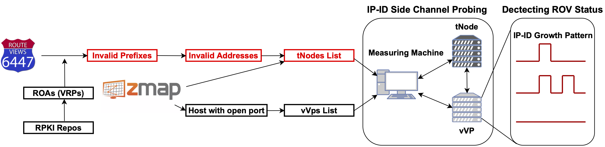
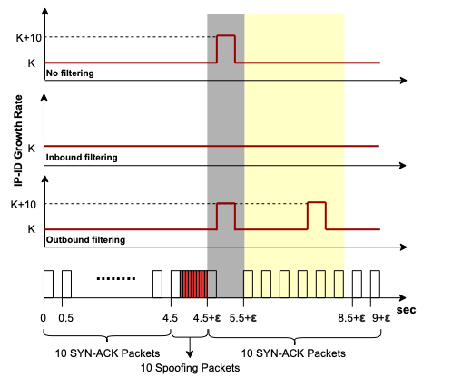

# RoVista: Measuring and Understanding the Route Origin Validation (ROV) in RPK
This is the code repo for RoVista. Paper will be public available soon
## Results
We public our daily measurement results here: https://rovista.netsecurelab.org/
## Methodology
The Resource Public Key Infrastructure (RPKI) is a system to add security to the Internet routing. In recent years, the publication of Route Origin Authorization (ROA) objects, which bind IP prefixes to their legitimate origin ASN, has been rapidly increasing. However, ROAs are effective only if the routers use them to verify and filter invalid BGP announcements, a process called Route Origin Validation (ROV).

We present RoVista, an ROV measurement framework that leverages IP-ID side channel and in-the-wild RPKI-invalid prefix. With over 16 months of longitudinal measurement, RoVista successfully covers more than 27K ASes where 56.1% of ASes have derived benefits from ROV, although the percentage of fully protected ASes remains relatively low at 9.4%. In order to validate our findings, we have also sought input from network operators.


## RoVista structure
ROVista measurement includes three steps: obtain vantage points, obtain RPKI invalid targets, and sending/detecting spoofing packet:

``` shell
├── script
│   ├── ip-id.py # spike detection in IP-ID
│   ├── rpki-tnode.py # finding tnodes under invalid prefix
│   ├── rpki-validation.py # validate BGP
│   ├── spoofing-parse-pcap.py # parsing pcap results
│   ├── spoofing-sender.py # sending spoofing TCP packet
│   └── tnode-test.py # testing tnodes with RIEP Atlas
├── utils
│   ├── download-routeviews.py # download BGP
│   ├── download-vrps.sh # download vrps
    └── rov-ratio.py # calculating AS level rov-ratio
```
### Obtain vantage points
We use ZMap to obtain a set of vVP candidates, which respond to our TCP SYN/ACK scans with a RST packet so that we can track their IP-ID values. 

### Obtain targets
Every 4 hours, we collect and validate RouteView datasets
with all RPKI objects collected from all of the five RPKI repositories to obtain test IP prefixes. `rpki-validation.py` for validating BGP and `rpki-tnode.py` for finding target node under invalid prefixes.

We then scan them using ZMap to find tNodes that open popular TCP port numbers so that we can send TCP SYN packets. 

Due to the incomplete view of the routing table in RouteViews, there can be tNodes that remain reachable through alternative routes. Thus, we take additional steps to minimize such erroneous tNodes using RIPE Atlas probes: `tnode-test.py`

### Sending spoofing packets
*need to use network that allow spoofing packets and do not filtering RPKI invalid.

We send spoofed TCP packet with vVPs's IP address to tNodes, while keep monitoring the IP-ID of vVPs. `spoofing-sender.py` for sending spoofed packets, `spoofing-parse-pcap.py` for parsing tcpdump file from monitoring IP-ID, and using `ip-id.py` to detect spike in IP-ID.
<figure>
    
    <figcaption>IP-ID growth pattern</figcaption>
</figure>